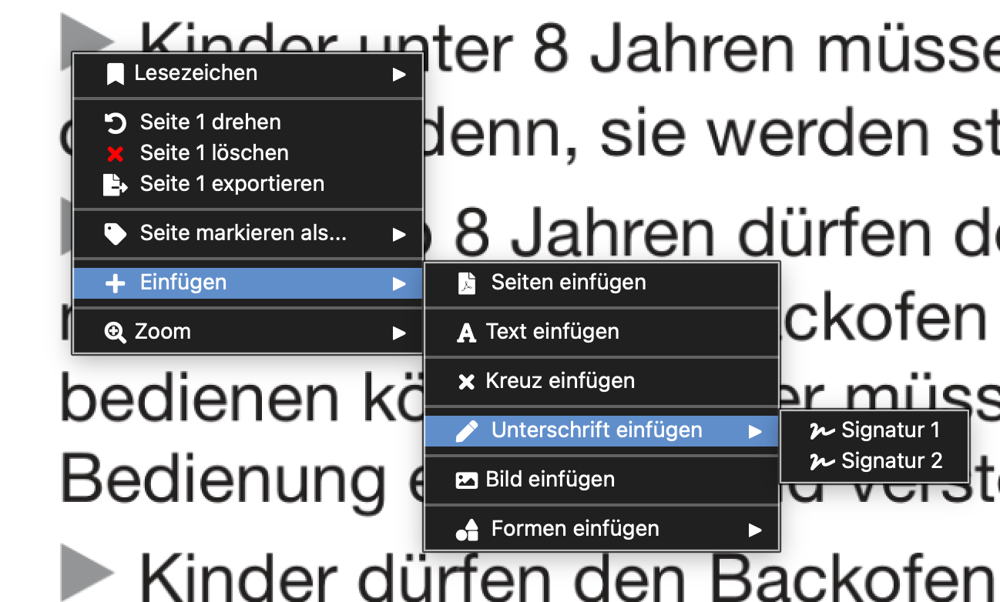
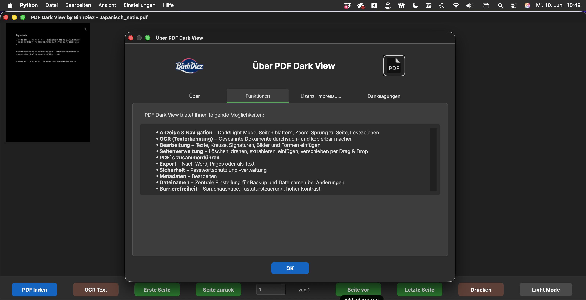
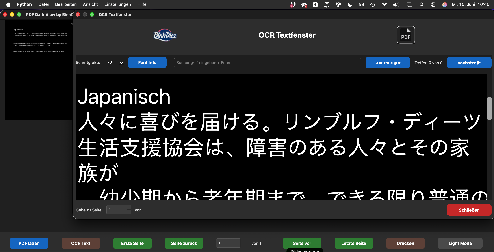

## PDFDarkView

> [!IMPORTANT]
> **This repository is no longer maintained.**
>
> Development has moved to the new official repository:
> 
## > **https://github.com/BinhDiez/PDFDarkView**
>
> All future updates, bug fixes, and releases will only be published there.

> > [!IMPORTANT]
> **Dieses Repository wird nicht mehr gepflegt.**
>
> Die Entwicklung wurde in das neue offizielle Repository verschoben:
> **https://github.com/BinhDiez/PDFDarkView**
>
> Alle zukünftigen Updates, Fehlerbehebungen und Releases werden ausschließlich dort veröffentlicht.

> > [!IMPORTANT]
> **Kho lưu trữ này không còn được duy trì.**
>
> Quá trình phát triển đã được chuyển sang kho lưu trữ chính thức mới:
> **https://github.com/BinhDiez/PDFDarkView**
>
> Tất cả các bản cập nhật, sửa lỗi và bản phát hành trong tương lai sẽ chỉ được phát hành tại đó.
> 

## PDFDarkView - PDF Bearbeitung leicht gemacht (Open Source)

  

**PDFDarkView** ist ein kostenloser Open-Source-PDF-Viewer und PDF-Editor für **macOS und Windows** mit OCR, Barrierefreiheitsfunktionen, Text-to-Speech, Mehrsprachigkeit und umfangreichen Werkzeugen zur PDF-Bearbeitung.

Die Anwendung vereint PDF-Anzeige, Bearbeitung, OCR-Texterkennung, Dokumentkonvertierung, Barrierefreiheit und PDF-Optimierung in einer einzigen Software – sowohl für den täglichen Einsatz als auch für Nutzer mit Sehbeeinträchtigungen.

---

# Funktionen

## Kernfunktionen

| Funktion | Beschreibung |
|----------|--------------|
| PDF-Anzeige | PDF-Dokumente öffnen und komfortabel durchsuchen |
| PDF-Bearbeitung | Inhalte direkt in PDFs einfügen und bearbeiten |
| OCR-Unterstützung | Texterkennung mit Tesseract OCR |
| Volltextsuche | Dokumentinhalte schnell durchsuchen |
| Lesezeichen | Erstellen, verwalten und navigieren |
| Textfenster | Extrahierten Dokumenttext anzeigen |
| Text-to-Speech | Dokumente vorlesen lassen |
| Dark Mode & Light Mode | Angenehme Darstellung in jeder Umgebung |
| Mehrsprachige Oberfläche | Verfügbar in 64 Sprachen |
| Barrierefreiheit | Optimiert für sehbehinderte und blinde Nutzer |

---

## Bearbeitungswerkzeuge

### Elemente einfügen

- Text
- Bild
- Signatur (passwortgeschützt)
- Häkchen
- Rechteck
- Ellipse
- Linie
- Pfeil
- Seitenzahlen
- Text-Wasserzeichen
- Bild-Wasserzeichen

### Redaktion (Schwärzen)

- Schwarze Schwärzung
- Weiße Schwärzung

---

## Seitenverwaltung

- Seite drehen
- Alle Seiten drehen
- Seitenausrichtung normalisieren
- Alle Seiten normalisieren
- Seiten löschen
- Seiten extrahieren
- Seiten einfügen
- Seiten verschieben
- Seitengröße ändern
- N-Up (mehrere Seiten pro Blatt)

---

## PDF-Verarbeitung

- PDFs zusammenführen
- PDFs überlagern
- PDFs zuschneiden
- PDFs abflachen (Flatten)
- PDFs optimieren
- In PDF/A konvertieren
- Dokumente schützen

---

## Export & Konvertierung

- Apple Pages
- DOCX
- TXT
- Seiten als Bilder exportieren
- Eingebettete Bilder extrahieren

---

## Metadaten

- Metadaten anzeigen
- Metadaten bearbeiten

---

## Einstellungen

### Allgemein

- OCR-Konfiguration
- Text-to-Speech-Einstellungen
- Passwortverwaltung
- Signatureinstellungen
- Backup-Einstellungen
- Dateinamenformatierung

### Darstellung

- Dark Mode
- Farbumkehr
- Einstellbarer Graustufen-Schwellwert

### Konfiguration

- Exporteinstellungen
- Importeinstellungen
- Anwendungssprache ändern
- 64 verfügbare Sprachen

---

## Barrierefreiheit

PDFDarkView enthält zahlreiche Funktionen zur Verbesserung der Zugänglichkeit.

- Text-to-Speech
- Dark Mode
- Farbumkehr
- Einstellbarer Graustufen-Schwellwert
- Große Zoomstufen
- Vollständige Tastaturbedienung
- Mehrsprachige Benutzeroberfläche

---

# Versionsverlauf

## Version 2.4.5

### Verbesserungen

- Weitere Zeitoptimierung durch Lazy Import`s

### Fehlerbehebungen

- Diverse Bugfixes

---

## Version 2.4.4

### Neu

- Dateisuffixe mit optionalem Benutzernamen

### Verbesserungen

- Weitere Zeitmessungen zur Performanceanalyse

### Fehlerbehebungen

- Diverse Bugfixes

---

## Version 2.4.3

### Neu

- Neue Sprache: Esperanto

### Verbesserungen

- Drucken unter Windows nutzt jetzt eine dafür geeignete Anwendung (Adobe Acrobat, Edge, Firefox, Foxit ...)

---

## Version 2.4.2

### Startzeit deutlich reduziert

Insbesondere im Netzwerk- und Citrix-Betrieb wurde die Startzeit erheblich verkürzt.

**Optimierungen**

- `shutil.which()` wird zuerst verwendet (kein Prozessstart, schneller Systemaufruf)
- Timeouts für `subprocess.run()` verhindern Blockaden von über zwei Sekunden pro Befehl
- Direkte Pfadlisten ersetzen aufwändige `subprocess`-Aufrufe
- Bundle-Pfade werden vor der Systemsuche bevorzugt
- Im Bundle-Modus entfällt die aufwändige Systemsuche vollständig
- Zeitmessungen werden im Log als **TIMING** protokolliert

---

## Version 2.4.1

### Neu

- Gerade und ungerade Seiten löschen

### Verbesserungen

- Dateisuffixe werden nun immer ersetzt
- Optionales Beibehalten wurde entfernt, um überlange Dateinamen zu verhindern
- Standard-OCR-Sprache entspricht automatisch der Sprache der Benutzeroberfläche

---

## Version 2.3.1

### Fehlerbehebungen

- Verbesserter PDF-Start per Doppelklick
- Optimiertes Logging

---

## Version 2.2.0

### Neu

- Verbesserte OCR-Erkennung
- Optimierter Dark Mode
- Updateprüfung beim Programmstart
- Automatische Erkennung der Systemsprache beim ersten Start
- Automatischer Download der Übersetzungen aus dem Repository
- Unterstützung für 64 Sprachen

### Fehlerbehebungen

- Diverse Bugfixes

---

# Unterstützte Plattformen

| Plattform | Unterstützung |
|-----------|---------------|
| macOS (Intel) | ✅ |
| macOS (Apple Silicon) | ✅ |
| Windows (64-Bit) | ✅ |

---

📸 Screenshots anzeigen

### PDF Bearbeiten / Einfügen (Dark Mode / Light Mode)

### Über PDFDarkView

### OCR Einstellungen

### OCR Textfenster

### Passwortverwaltung

---

# Suchbegriffe

PDF Viewer, PDF Betrachter, PDF Reader, PDF Editor, PDF bearbeiten, PDF bearbeiten kostenlos, Open Source PDF, kostenlose PDF-Software, OCR, Texterkennung, Dokumentenerkennung, gescannte Dokumente erkennen, PDF durchsuchbar machen, PDF zusammenführen, PDF optimieren, PDF komprimieren, PDF in PDF/A umwandeln, PDF zuschneiden, PDF drehen, Seiten extrahieren, Seiten löschen, Seiten verschieben, Ankreuzen, Bilder einfügen, Formen einfügen, Text einfügen, Unterschrift einfügen, Wasserzeichen einfügen, PDF schwärzen, Dokumente anonymisieren, PDF Signatur, PDF unterschreiben, Metadaten bearbeiten, PDF vorlesen, Text-to-Speech, Barrierefreiheit, Sehbehinderung, Screenreader, Sprachausgabe, Dark Mode, Light Mode, Dunkelmodus, PDF-Software Windows, PDF-Software macOS, Tesseract OCR, GUI-Übersetzung, mehrsprachige Benutzeroberfläche.

---

# Lizenzen / Licenses

## Deutsch

PDFDarkView wird unter der MIT-Lizenz veröffentlicht.

Dieses Projekt verwendet verschiedene Open-Source-Bibliotheken und Komponenten von Drittanbietern. Diese Abhängigkeiten unterliegen weiterhin ihren jeweiligen Lizenzen und Copyright-Hinweisen.

Die MIT-Lizenz von PDFDarkView gilt ausschließlich für den ursprünglichen Quellcode dieses Projekts und ersetzt oder verändert nicht die Lizenzbedingungen der verwendeten Drittanbieter-Software.

Details zu den verwendeten Komponenten und deren jeweiligen Lizenzen befinden sich in der Datei `THIRD_PARTY_LICENSES.md`.

---

## English

PDFDarkView is released under the MIT License.

This project uses a number of third-party open-source libraries and components. These dependencies remain subject to their own licenses and copyright notices.

The MIT License of PDFDarkView applies only to the original source code of this project and does not replace or modify the license terms of any third-party software.

For details regarding third-party components and their respective licenses, please refer to the `THIRD_PARTY_LICENSES.md` file.

---

🖥️ Download-Info

| Suffix | Betriebssystem |
|--------|-----------------|
| `_macOS_as` | Alle Macs mit Apple Silicon (M1, M2, M3, M4 …) |
| `_macOS_intel` | Alle Macs mit Intel-Prozessor |
| `_win` | Windows x64 (AMD64/x86-64) – Windows 7, 8.1, 10 und 11 |

> **Hinweis:** Windows on ARM wird derzeit nicht unterstützt.

🖥️ macOS-Sicherheitshinweis

# macOS-Sicherheitshinweis

PDFDarkView ist derzeit nicht mit einem Apple-Developer-Zertifikat signiert.

Beim ersten Start kann macOS Gatekeeper die Ausführung blockieren.

So lässt sich die Anwendung dennoch öffnen:

1. Versuche, PDFDarkView.app einmal zu öffnen.
2. Die Warnung erscheint – klicke auf **Fertig** oder **Abbrechen**. (Nicht in den Papierkorb legen)
3. Öffne **Systemeinstellungen** → **Datenschutz & Sicherheit**.
4. Scrolle nach unten. 
   Dort sollte eine Meldung erscheinen wie:
   **„PDFDarkView.app wurde blockiert …“**
6. Bestätige den Dialog mit **Öffnen**.

🔑 Passwort für die ZIP Dateien:

BinhDiez

